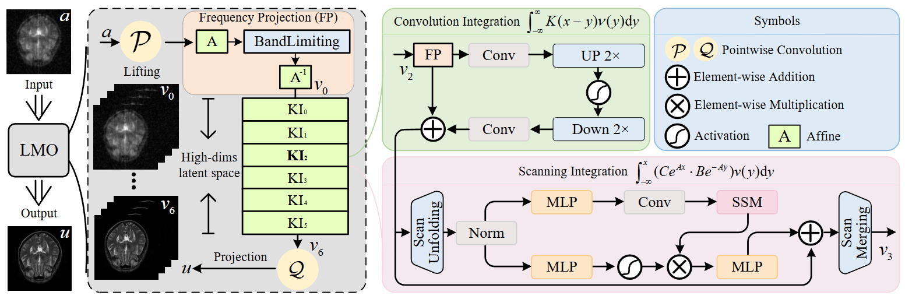

<div align="center">
<h1>LMO </h1>
<h3>LMO: Linear Mamba Operator for MRI Reconstruction</h3>

[WeiLi]()<sup>1</sup> \*,[Jiawei Jiang]()<sup>1</sup> \*,[Jie Wu]()<sup>1</sup>, [Kaihao Yu]()<sup>1</sup>, [Jianwei Zheng](https://zhengjianwei2.github.io/)<sup>1 :email:</sup>

<sup>1</sup>  Zhejiang University of Technology

(\*) equal contribution, (<sup>:email:</sup>) corresponding author.

CVPR 2025 ([conference paper](https://openaccess.thecvf.com/content/CVPR2025/html/Li_LMO_Linear_Mamba_Operator_for_MRI_Reconstruction_CVPR_2025_paper.html))

</div>

## Abstract
Interpretability and consistency have long been crucial factors in MRI reconstruction. While interpretability has been significantly innovated with the emerging deep unfolding networks, current solutions still suffer from inconsistency issues and produce inferior anatomical structures. Especially in out-of-distribution cases, e.g., when the acceleration rate (AR) varies, the generalization performance is often catastrophic. To counteract the dilemma, we propose an innovative Linear Mamba Operator (LMO) to ensure consistency and generalization, while still enjoying desirable interpretability. Theoretically, we argue that mapping between function spaces, rather than between signal instances, provides a solid foundation of high generalization. Technically, LMO achieves a good balance between global integration facilitated by a state space model that scans the whole function domain, and local integration engaged with an appealing property of continuous-discrete equivalence. On that basis, learning holistic features can be guaranteed, tapping the potential of maximizing data consistency. Quantitative and qualitative results demonstrate that LMO significantly outperforms other state-of-the-arts. More importantly, LMO is the unique model that, with AR changed, achieves retraining performance without retraining steps. Codes are available at https://github.com/ZhengJianwei2/LMO.

## Overview
<div align="center">

</div>

## Train

Open source code this week

## Evaluation on Provided Weights

Open source code this week

## Acknowledgement :heart:
This project is based on CNO ([paper](https://arxiv.org/pdf/2302.01178), [code](https://github.com/camlab-ethz/ConvolutionalNeuralOperator)), PGIUN ([paper](https://ieeexplore.ieee.org/abstract/document/10584139), [code](https://github.com/Jiangjiawei2/PGIUN)), MambaNO ([paper](https://proceedings.neurips.cc/paper_files/paper/2024/hash/5ee553ec47c31e46a1209bb858b30aa5-Abstract-Conference.html), [code](https://github.com/ZhengJianwei2/Mamba-Neural-Operator)). 

Thanks for their wonderful works.

## Citation
If you find LMO is useful in your research or applications, please consider giving us a star 🌟 and citing it by the following BibTeX entry.

```bibtex
@InProceedings{Li_2025_CVPR,
    author    = {Li, Wei and Jiang, Jiawei and Wu, Jie and Yu, Kaihao and Zheng, Jianwei},
    title     = {LMO: Linear Mamba Operator for MRI Reconstruction},
    booktitle = {Proceedings of the Computer Vision and Pattern Recognition Conference (CVPR)},
    month     = {June},
    year      = {2025},
    pages     = {5112-5122}
}
```
